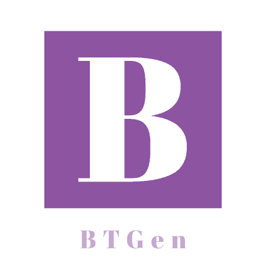

# BTGen v0.1.2

The web development boilerplate CLI generator tool.

## Install
---

To install you need to have already installed <a href="https://nodejs.org/">nodejs</a> & npm.

With that, just run this:

```sh
$ npm install -g btgen
```

That's it!

Also you can install it locally following these simple steps:

1. Clone this repository with:
```sh
$ git clone https://github.com/kenliten/btgen.git
```
2. Go to the folder:
```sh
$ cd btgen
```
3. Link it to your environment with: 
```sh
$ npm link
```

## Use
---

To use the CLI just type the following:

```sh
$ btgen <template> <project_name>
```

More info in the [official documentation](https://kenliten.github.io/btgen-doc/).

## TODO
---

- Add nodemvc template
- Add mevn template
- Add mern template
- Add mean template
- Add vueapp template
- Add vuespa template
- Add phppage template
- Add phpapp template
- Add chrext template
- Add firext template
- Add reactapp template
- Add spanish support

## Suggestions & Feedback

If you want a template that is not listed here, or maybe want to feedback, you can mail me to <otonielreyesgalay@gmail.com>.

